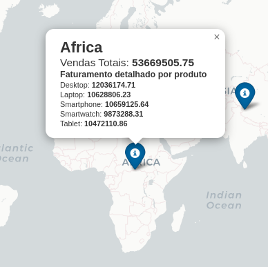

# Dashboard de Faturamento Global

**Equipe**:
- Cahu Silva
- Gabriel Santana
- Saulo Bernardo
- Wiliams Alves

## Contextualização
A multinacional “Device Corporation” tem enfrentado problemas para tomar decisões na logística de vendas de seus produtos eletrônicos e quantidade de equipamentos eletrônico nas regiões destacadas. Ao mostrarmos o total de vendas em 2022 a 2024 nas regiões, podemos indicar curvas de consumo para prospecção de vendas.

## Objetivo
Criação de um dashboard de faturamento global, onde facilitará a visualização dos dados de faturamento da companhia. Na ferramenta encontrará uma visão abrangente do desempenho financeiro da empresa em diferentes regiões do mundo, além de uma análise detalhada por produto. A ferramenta deverá projetada deverá ser capaz de fornecer insights valiosos que ajudarão na tomada de decisões estratégicas.

## Acesso ao Dashboard

**Clique na imagem abaixo ou no acesse o QRcode**

| | |
|---------------------|---------------------|

## Insights
- **Faturamento por Região**
    
    Observa-se que as 3 regiões com maiores faturamentos foram a Europa com o maior faturamento de 55.331.817,87, seguido da Oceania com 54.465.322,45 e Africa com 53.669.505,75:

|   |   |   |
|---------------------------|---------------------------|---------------------------|

- **Faturamento por Produto**:

    Como podemos constatar ao observar o gráfico, existe baixa variação nos totais de vendas dos produtos, com um destaque sutil nos produtos "Smartphone", "Desktop" e "Smartwatch":

- **Desempenho do Faturamento Mês a Mês**:

    Observamos que há uma queda forte nas vendas entre o mês de Agosto e Setembro, e uma leve recuperação no mês de Novembro, seguida de mais uma queda em Dezembro:

## Conclusão

Com base nas informações extraídas do dashboard, notamos que a maior parte dos consumidores dos produtos da empresa está localizada nos continentes europeu, oceânico e africano. Observamos também que, de maneira geral, os produtos são procurados em todos os continentes. No entanto, identificamos um problema no desempenho da empresa: nos meses em que haveria expectativa de vendas elevadas devido a datas festivas, ocorre uma queda acentuada nas vendas.

